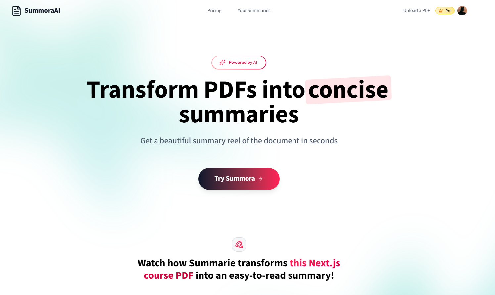
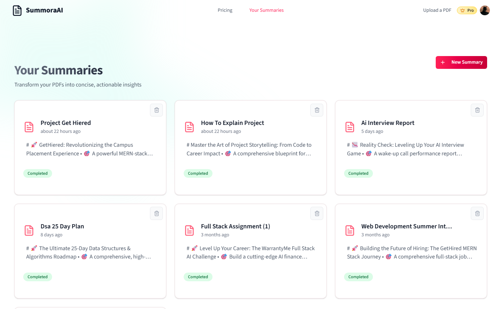
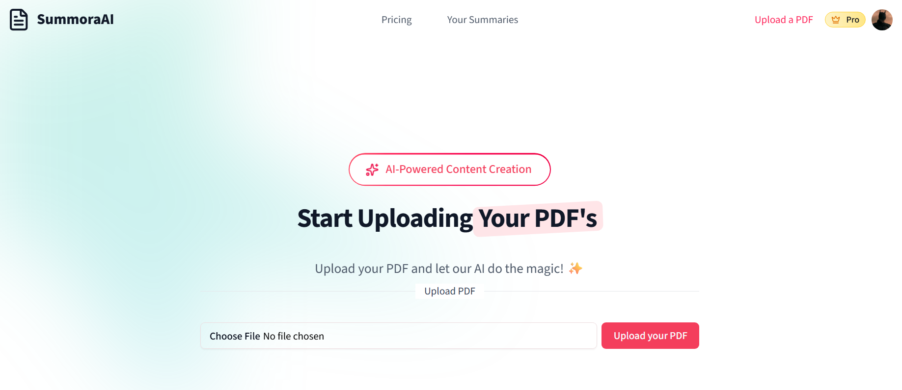

# 📄 SummoraAI – Transform PDFs into Beautiful, AI-Powered Summaries

SummoraAI is a powerful web application that turns your lengthy PDF documents into concise, engaging, and emoji-rich summaries – like a visual reel of your content. Built with cutting-edge technologies including **Next.js 15**, **Gemini AI**, **Clerk**, **Langchain**, and more.

🔗 **Live Demo:** [https://summora-ai-green.vercel.app](https://summora-ai-green.vercel.app)

# Home Page



# Dashboard



# Upload Page



# Summary Page


---

## ⚡ Features

### 🔧 Core Technologies:

- 🚀**Next.js 15 App Router** – for server-side rendering, routing, and API endpoints using Server Components.
- ❄️**React** – for building dynamic and interactive user interfaces.
- 🔑**Clerk** – for secure, modern authentication (Passkeys, GitHub, Google).
- 🤖**Gemini AI** – for powerful AI-driven summarization with contextual understanding.
- 🧠**Langchain** – for parsing PDFs, extracting text, and chunking documents efficiently.
- 🎨**ShadCN UI** – for clean, accessible, and customizable UI components.
- 💾**NeonDB (PostgreSQL)** – for serverless, scalable database storage of user data and summaries.
- 🖨️**UploadThing** – for secure PDF file uploads (up to 32MB).
- 💰**Stripe** – for subscription plans, billing, and payment handling.
- 📜**TypeScript** – for type safety and better development experience.
- 💅**Tailwind CSS 4** – for modern, utility-first styling.

---

### ⚙️ Application Features:

- 📚 Clear, structured, AI-powered summaries with key points.
- 🎥 Interactive summary viewer with beautiful styling and progress tracking.
- 🔐 Secure file uploads and processing.
- 🧑‍💼 Protected routes and authenticated dashboard.
- 💳 Flexible pricing plans (Basic & Pro) with Stripe.
- 📩 Webhook handling for Stripe events.
- 📂 User dashboard to view/manage all summaries.
- 📱 Fully responsive design (mobile + desktop).
- 🚀 Real-time updates and path revalidation.
- 🔔 Toast notifications for uploads, processing, and errors.
- 🧠 SEO-friendly metadata generation for summaries.
- ⚡ Production-ready, optimized for speed and UX.

---

## 🚀 Getting Started

To run this project locally:

1. **Fork this repository**
2. **Clone your fork**
   ```bash
   git clone https://github.com/ujjwalofficial102/SummoraAI.git
   cd summora-ai
   ```
3. Create the required credentials:
   - Gemini API key
   - Clerk authentication
   - UploadThing configuration
   - Stripe payment setup
   - NeonDB database connection
4. Install dependencied with `npm install`
5. Run the development server with `npm run dev`

---

## 🙏 Acknowledgements

- [Clerk](https://clerk.com/) for authentication
- [GeminiAI](https://gemini.google.com/app) for gemini api
- [Langchain](https://www.langchain.com/) for document processing
- [ShadCN](https://ui.shadcn.com/) for components

---

## 📜 License

This project is licensed under the MIT License.

---

## 🙌 Contributing

Contributions are welcome! Feel free to open issues or submit pull requests.

---

## 📧 Contact

For questions or suggestions, reach out to **[Ujjwal Mishra](https://github.com/ujjwalofficial102)**.

- **LinkedIn:** [Ujjwal Mishra](https://www.linkedin.com/in/ujjwalmishra102)
- **Email:** [ujjwalmishra102@gmail.com](mailto:ujjwalmishra102@gmail.com)
